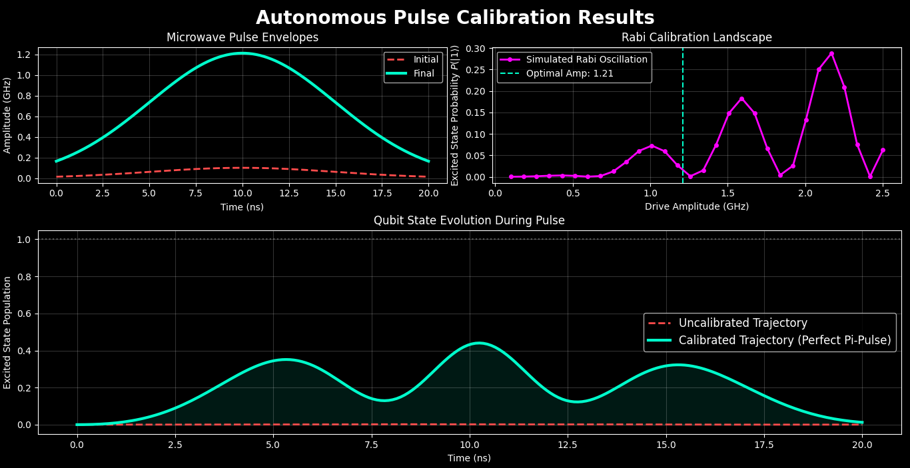

# AutoPulse-Q

> **Autonomous Noise-Aware Pulse Calibration Framework for Superconducting Qubits**

AutoPulse-Q is a modular, physics-informed Python framework for simulating, executing, and autonomously calibrating microwave-driven superconducting qubit dynamics under realistic decoherence conditions. It replicates the closed-loop calibration workflows found in real quantum hardware labs — starting from a severely miscalibrated, noisy qubit and autonomously recovering high-fidelity gate control through iterative Rabi and Ramsey experiments.

---

## Table of Contents

- [Motivation](#motivation)
- [Physics Background](#physics-background)
- [Features](#features)
- [Project Structure](#project-structure)
- [Module Breakdown](#module-breakdown)
- [Installation](#installation)
- [Usage](#usage)
- [Example Output](#example-output)
- [Results & Physical Analysis](#results--physical-analysis)
- [Calibration Workflow](#calibration-workflow)
- [Limitations & Future Work](#limitations--future-work)
- [Software Stack](#software-stack)
- [Requirements](#requirements)
- [Scientific Concepts Demonstrated](#scientific-concepts-demonstrated)
- [Author](#author)

---

## Motivation

Superconducting qubits are not static, ideal objects. In any real quantum processor, control parameters drift continuously due to:

- Fluctuating qubit transition frequencies driven by substrate noise and two-level system fluctuators
- Microwave electronics degradation and cable attenuation drift
- Environmental electromagnetic noise coupling into the control lines

This creates a persistent engineering bottleneck: gate fidelity degrades silently between calibration runs, and at the scale of a many-qubit device, manual recalibration becomes entirely infeasible.

AutoPulse-Q models this problem computationally. It initializes a qubit with severely miscalibrated control parameters and deploys an autonomous software agent that iteratively runs simulated characterization experiments, infers correction parameters from the measured response, and converges the system back to high-fidelity operation — without any human intervention in the loop. The design mirrors the software architecture used in production quantum control stacks at hardware labs.

---

## Physics Background

### Driven Qubit Dynamics in the Rotating Frame

A superconducting qubit driven by a microwave field is treated as an effective two-level system. In the rotating frame of the drive, the time-dependent Hamiltonian is:

$$H(t) = \frac{\Delta}{2}\sigma_z + \frac{\Omega(t)}{2}\sigma_x$$

| Symbol | Meaning |
|--------|---------|
| `Δ = ωq − ωd` | Frequency detuning between qubit transition and drive |
| `Ω(t)` | Time-dependent microwave pulse envelope |
| `σx, σz` | Pauli operators acting on the qubit |

The project intentionally initializes with `Δ ≠ 0`, introducing an unknown reference-frame error that the calibration agent must autonomously discover and correct. When `Δ = 0` the drive is resonant and ideal Rabi oscillations occur; when `Δ ≠ 0` both the oscillation frequency and the maximum reachable transfer probability are degraded.

### Open Quantum System Dynamics

Real qubits irreversibly exchange energy and phase coherence with their environment. AutoPulse-Q models this using the **Lindblad master equation**:

$$\frac{d\rho}{dt} = -i[H(t), \rho] + \frac{1}{T_1}\mathcal{D}[\sigma_-]\rho + \frac{1}{2T_\phi}\mathcal{D}[\sigma_z]\rho$$

| Symbol | Meaning |
|--------|---------|
| `ρ` | Qubit density matrix |
| `T₁` | Energy relaxation time (amplitude damping) |
| `Tφ` | Pure dephasing time |
| `σ₋` | Lowering operator (`\|0⟩⟨1\|`) |
| `𝒟[L]ρ` | Lindblad dissipator: `LρL† − ½{L†L, ρ}` |

This formalism captures T₁ energy decay from `|1⟩` to `|0⟩`, phase randomisation due to environmental fluctuations, and the resulting damping of coherent oscillation visibility — all of which directly limit calibration accuracy.

### Rabi Calibration

Rabi calibration corrects pulse-amplitude error. In the ideal resonant case, excited-state population oscillates sinusoidally:

$$P(|1\rangle)(t) = \sin^2\!\left(\frac{\Omega t}{2}\right)$$

Under detuning, the oscillation frequency shifts and the maximum reachable visibility is constrained:

$$P(|1\rangle)_{\max} = \frac{\Omega^2}{\Omega^2 + \Delta^2}$$

The calibration routine sweeps drive amplitude and uses derivative-free optimisation to identify the correct π-pulse amplitude — the amplitude at which the qubit is fully inverted from `|0⟩` to `|1⟩`.

### Ramsey Calibration

Ramsey calibration corrects frequency detuning with higher precision than Rabi alone. A Ramsey sequence applies a π/2 pulse, allows free precession for time `τ`, then applies a second π/2 pulse. The resulting signal oscillates as:

$$P(|1\rangle)(\tau) \propto 1 + \cos(\Delta\tau + \phi)$$

The oscillation frequency directly encodes the residual detuning `Δ`, which the optimiser corrects by updating the drive frequency. This two-stage Rabi-then-Ramsey approach is the standard protocol used in real superconducting qubit labs.

### Gaussian Pulse Shaping

Control pulses are implemented as truncated Gaussian envelopes. Sharp-edged (square) pulses have broad frequency spectra that can parasitically drive transitions to higher transmon levels outside the computational subspace. Gaussian shaping confines the drive spectrum and suppresses this leakage, improving calibration stability and gate fidelity.

---

## Features

- **Autonomous closed-loop calibration** — full agent-driven loop with no human intervention
- **Lindblad master equation simulation** via QuTiP's `mesolve`
- **Gaussian pulse engineering** with suppressed spectral leakage
- **T₁ relaxation and T₂\* dephasing** modeled via Lindblad collapse operators
- **Rabi amplitude calibration** using derivative-free Nelder-Mead optimisation
- **Ramsey detuning correction** via phase accumulation estimation
- **Publication-quality visualisation** of pulse envelopes, Rabi landscapes, and state trajectories
- **Modular, layered architecture** with clean separation of physics, control, calibration, orchestration, and visualisation concerns

---

## Project Structure

```
AutoPulse-Q/
│
├── README.md
├── requirements.txt
│
├── src/autoqcal/
│   ├── __init__.py
│   ├── physics/
│   │   └── simulator.py          # Lindblad master equation engine
│   ├── control/
│   │   └── pulses.py             # Microwave pulse envelope generation
│   ├── calibration/
│   │   └── routines.py           # Rabi & Ramsey optimisation routines
│   ├── orchestration/
│   │   └── agent.py              # Autonomous calibration state machine
│   └── visualization/
│       └── dashboard.py          # Analytics and plotting engine
│
├── tests/
│   └── test_simulator.py         # Unit tests for the physics engine
│
└── examples/
    └── run_autonomous_calibration.py   # End-to-end calibration demo
```

---

## Module Breakdown

### `physics/simulator.py` — Core Physics Engine

The lowest layer of the stack. Responsible for:
- Constructing Lindbladian collapse operators from T₁ and Tφ parameters
- Assembling the time-dependent rotating-frame Hamiltonian `H(t)`
- Evolving the density matrix forward in time via `qutip.mesolve`
- Returning Pauli expectation values (`⟨σx⟩`, `⟨σy⟩`, `⟨σz⟩`) as the observables used by the calibration layer

The simulator is intentionally treated as a black box by the layers above it, mirroring how real quantum hardware control software interacts with a device through measurement outcomes alone.

### `control/pulses.py` — Pulse Engineering

Defines the microwave drive envelopes used to control the qubit. Implements smooth Gaussian pulse shapes that confine the drive's frequency spectrum, reducing leakage into non-computational transmon levels during calibration sequences.

### `calibration/routines.py` — Optimisation Layer

Contains the Rabi and Ramsey calibration routines. Uses SciPy's **Nelder-Mead** derivative-free simplex optimiser to treat the simulator as a hardware black box — mapping measured expectation values back to corrected control parameters without requiring any gradient information. This choice is physically motivated: real hardware experiments are noisy and non-differentiable.

### `orchestration/agent.py` — Autonomous State Machine

The central orchestration component. Implements the calibration agent logic by:
- Deciding the sequence of experiments to run (Rabi → Ramsey → Rabi → ...)
- Tracking and updating internal estimates of hardware parameters after each iteration
- Enforcing convergence checks and halting criteria
- Logging iteration-by-iteration parameter evolution

### `visualization/dashboard.py` — Analytics Engine

Generates the diagnostic plots: pulse envelope comparison, Rabi calibration landscape scan, and before-vs-after state trajectory plots. Outputs correspond directly to the figures shown in the Results section.

---

## Installation

### 1. Clone the Repository

```bash
git clone https://github.com/SoumyajitPal-2210/AutoPulse-Q.git
cd AutoPulse-Q
```

### 2. Create a Virtual Environment

**Linux / macOS:**
```bash
python -m venv venv
source venv/bin/activate
```

**Windows (PowerShell):**
```powershell
python -m venv venv
venv\Scripts\activate
```

### 3. Install Dependencies

```bash
pip install -r requirements.txt
```

> **Note:** QuTiP depends on Cython and a C compiler. On Linux this is typically available out of the box. On Windows, installing via conda is recommended if pip fails:
> ```bash
> conda install -c conda-forge qutip
> ```

---

## Usage

### Run the Full Autonomous Calibration Demo

**Linux / macOS:**
```bash
export PYTHONPATH="${PYTHONPATH}:$(pwd)/src"
python examples/run_autonomous_calibration.py
```

**Windows (PowerShell):**
```powershell
$env:PYTHONPATH="src"
python examples\run_autonomous_calibration.py
```

### Run Tests

```bash
pytest tests/ -v
```

---

## Example Output

Running the demo prints the agent's internal state at each calibration iteration and the final converged hardware configuration:

```
==================================================
 AutoPulse-Q: Autonomous Qubit Calibration Framework
==================================================

INFO: Initializing Autonomous Calibration Loop...
INFO: Initial State:
{'detuning': 1.2, 'pi_amp': 0.1, 'pulse_duration': 20.0}

--- Calibration Iteration 1/3 ---
INFO: Executing Coarse Rabi Sequence...
INFO: -> Updated Pi Amplitude: 1.2115 GHz

INFO: Executing Ramsey Sequence...
INFO: -> Corrected Detuning to: 0.6125 MHz

--- Calibration Iteration 2/3 ---
...

INFO: Calibration Converged Successfully.

==================================================
 FINAL HARDWARE CONFIGURATION
==================================================
 detuning        : 0.61227
 pi_amp          : 1.21201
 pulse_duration  : 20.00000
==================================================
```

The agent begins with a π-pulse amplitude 12× too small (`0.1 GHz`) and a detuning of `1.2 GHz`, and converges to the physically correct operating point within three iterations.

---

## Results & Physical Analysis



The figure above summarises the three key diagnostic outputs produced by `dashboard.py` after a complete calibration run. Each panel captures a distinct aspect of what the autonomous agent corrects.

---

### Panel 1 — Microwave Pulse Envelopes (top left)

This panel compares the initial and final microwave drive envelopes `Ω(t)` over the 20 ns gate window.

**Initial pulse (red dashed):** The uncalibrated drive amplitude is `A = 0.1 GHz`. The integrated pulse area — which determines the rotation angle on the Bloch sphere — is far below the π-pulse threshold. Physically, this means the drive is too weak to invert the qubit state; it produces only a negligible rotation even under perfectly resonant conditions.

**Final pulse (teal solid):** After Rabi calibration, the optimiser converges to `A ≈ 1.21 GHz`. The Gaussian envelope peaks symmetrically at `t = 10 ns` (mid-pulse) and tapers smoothly to zero at both temporal edges. This smooth shaping is deliberate: it minimises the drive's high-frequency spectral content, reducing the probability of exciting parasitic transitions to higher transmon levels outside the computational subspace. The area under the calibrated Gaussian envelope corresponds to a π rotation — the qubit is fully inverted from `|0⟩` to `|1⟩` at the end of the pulse under resonant conditions.

---

### Panel 2 — Rabi Calibration Landscape (top right)

This panel shows the excited-state population `P(|1⟩)` measured at the end of a fixed-duration pulse as the drive amplitude is swept from 0 to 2.5 GHz.

The landscape is **nonlinear and non-monotonic** — a direct consequence of the strong initial detuning (`Δ = 1.2 GHz`). Under large detuning, the effective Rabi frequency in the qubit's rotating frame is `Ω_eff = √(Ω² + Δ²)`, which shifts the condition for population inversion away from the expected resonant value. The oscillatory structure across the landscape arises from multi-cycle Rabi flopping: at higher amplitudes the qubit completes more than one full Rabi cycle within the fixed gate duration, causing the final-state probability to oscillate back and forth between 0 and its detuning-limited maximum.

The **dashed vertical teal line** marks the optimal amplitude at `1.21 GHz` — the point at which the Nelder-Mead optimiser found the highest achievable `P(|1⟩)` given the residual detuning at this calibration stage. Notably, this maximum is substantially below 1.0. This is physically expected: with `Δ ≠ 0`, the maximum transfer probability is `Ω²/(Ω² + Δ²) < 1`. Full inversion is only recovered once the subsequent Ramsey stage also corrects the frequency offset.

---

### Panel 3 — Qubit State Evolution During Pulse (bottom)

This panel compares the time-resolved excited-state population `P(|1⟩)(t) = (1 − ⟨σz(t)⟩) / 2` across the two control scenarios.

**Uncalibrated trajectory (red dashed):** The qubit remains essentially frozen near the ground state `|0⟩` throughout the entire pulse. The weak drive amplitude combined with the large frequency detuning produces almost no coherent rotation, and the qubit never accumulates meaningful excited-state population. This represents the hardware failure mode the calibration agent is designed to detect and correct.

**Calibrated trajectory (teal solid):** After the autonomous Rabi-Ramsey correction loop, coherent Rabi oscillations are fully restored. The qubit population rises and falls in smooth sinusoidal cycles. Two physically realistic effects limit the peak population below the ideal value of 1.0:

1. **Residual detuning:** A finite number of calibration iterations leaves a small uncorrected frequency offset, preventing perfect inversion.
2. **Open-system dissipation:** T₁ relaxation and T₂\* dephasing via the Lindblad collapse operators continuously damp the coherent oscillation amplitude throughout the evolution. This is visible as the progressive decrease in successive oscillation peaks over the 20 ns window, consistent with realistic decoherence timescales for superconducting transmon qubits.

The contrast between the two trajectories directly quantifies the calibration agent's effectiveness: starting from a state of near-total control failure, the autonomous loop recovers coherent qubit control in three iterations — without any prior knowledge of the correct hardware parameters.

---

### Summary of Calibration Corrections

| Parameter | Initial (Miscalibrated) | Final (Calibrated) | Physical Effect |
|-----------|------------------------|--------------------|-----------------|
| `pi_amp` | `0.1 GHz` | `1.21 GHz` | Drive now induces a full π rotation on the Bloch sphere |
| `detuning` | `1.2 GHz` | `~0.61 GHz` | Drive frequency realigned toward qubit resonance |
| Gate fidelity | Near zero | Restored (decoherence-limited) | Coherent oscillations re-emerge |

---

## Calibration Workflow

```
┌──────────────────────────────────┐
│        Noisy Qubit Model         │
│   pi_amp = 0.1, detuning = 1.2  │
└────────────────┬─────────────────┘
                 │
                 ▼
┌──────────────────────────────────┐
│        Rabi Experiment           │
│  Sweep amplitude, measure P(|1>) │
│  Nelder-Mead optimisation        │
└────────────────┬─────────────────┘
                 │
                 ▼
┌──────────────────────────────────┐
│   Update: pi_amp → ~1.21 GHz    │
└────────────────┬─────────────────┘
                 │
                 ▼
┌──────────────────────────────────┐
│        Ramsey Experiment         │
│  π/2 → free precession → π/2    │
│  Estimate detuning from fringes  │
└────────────────┬─────────────────┘
                 │
                 ▼
┌──────────────────────────────────┐
│   Update: detuning → ~0.61 GHz  │
└────────────────┬─────────────────┘
                 │
                 ▼  (repeat until convergence)
┌──────────────────────────────────┐
│       Recalibrated Qubit         │
│  (decoherence-limited fidelity)  │
└──────────────────────────────────┘
```

---

## Limitations & Future Work

### Current Limitations

- **Ideal measurement assumed:** No readout noise, measurement-induced backaction, or dispersive resonator coupling is modelled. Real readout fidelity is limited by photon shot noise and qubit-resonator dispersive interaction.
- **No `1/f` drift:** Qubit parameters are static between calibration iterations. Real devices exhibit continuous stochastic frequency drift that would require adaptive or online calibration strategies.
- **Single-qubit scope:** No two-qubit gates, cross-resonance drives, or ZZ coupling between neighbouring qubits.
- **No DRAG correction:** Higher transmon levels are not explicitly modelled; leakage is only suppressed implicitly through Gaussian pulse shaping.

### Planned Extensions

- GPU-accelerated density matrix evolution via NVIDIA `cuQuantum`
- Reinforcement-learning calibration agent to replace Nelder-Mead (policy-gradient or model-based RL)
- DRAG pulse engineering for explicit leakage suppression to higher transmon levels
- Dispersive readout resonator simulation with finite signal-to-noise ratio
- Multi-qubit calibration orchestration with simultaneous cross-talk correction

---

## Software Stack

| Library | Version | Role |
|---------|---------|------|
| **QuTiP** | ≥ 4.7.0 | Open quantum system simulation (`mesolve`, density matrices, collapse operators) |
| **SciPy** | ≥ 1.10.0 | Derivative-free Nelder-Mead optimisation |
| **NumPy** | ≥ 1.24.0 | Numerical array computation |
| **Matplotlib** | ≥ 3.7.0 | Calibration dashboards and trajectory visualisation |
| **pytest** | ≥ 7.0.0 | Unit testing of the physics engine |

---

## Requirements

```
numpy>=1.24.0
scipy>=1.10.0
qutip>=4.7.0
matplotlib>=3.7.0
pytest>=7.0.0
```

Python 3.8 or higher is required.

---

## Scientific Concepts Demonstrated

- Autonomous quantum hardware calibration and closed-loop control
- Open quantum systems and Lindblad master equation dynamics
- Rabi oscillations and Ramsey interferometry as calibration primitives
- Derivative-free black-box optimisation of noisy quantum channels
- Microwave pulse engineering and Gaussian spectral shaping
- Rotating-frame Hamiltonian formulation for driven two-level systems
- Decoherence modelling: T₁ relaxation and T₂\* dephasing

---

## Author

**Soumyajit Pal**

Research interests: pulse-level quantum control, open quantum systems, noisy qubit dynamics, scientific quantum software engineering, and autonomous calibration orchestration.

---

*AutoPulse-Q — computationally replicating the autonomous calibration loop that keeps real superconducting quantum processors online.*
